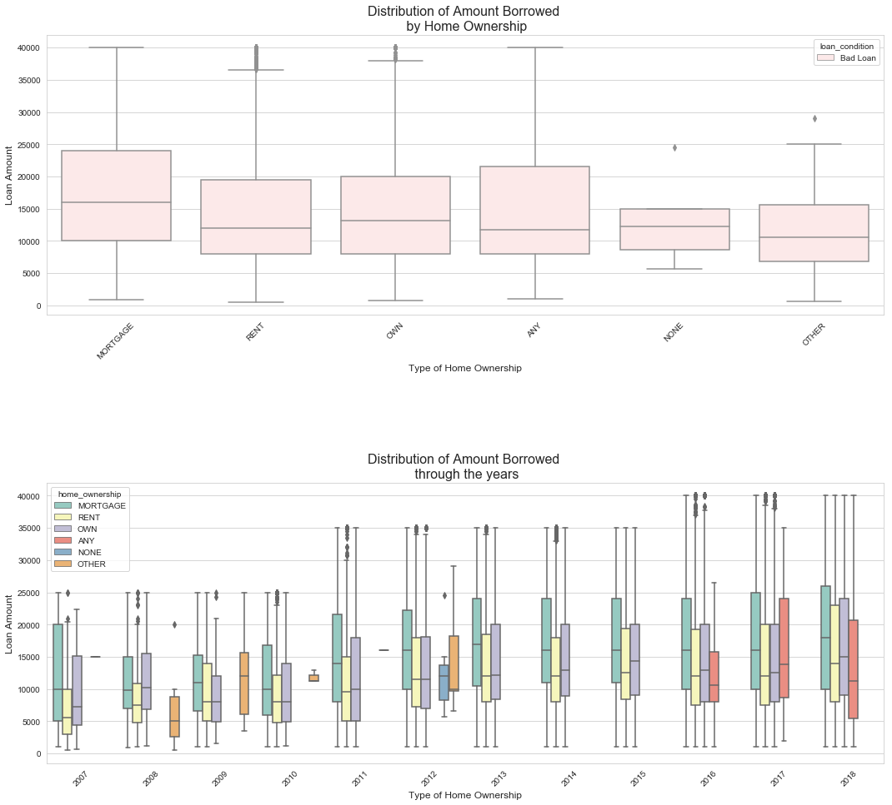

<h1 align="center"> Lending Club Loan Analysis </h1> <br>


## Company Information:
Lending Club is a  peer to peer lending company based in the United States, in which investors provide funds for potential borrowers and investors earn a profit depending on the risk they take (the borrowers credit score). Lending Club provides the "bridge" between investors and borrowers. For more basic information about the company please check out the wikipedia article about the company. <br><br>


<a src="https://en.wikipedia.org/wiki/Lending_Club"> Lending Club Information </a>


## How Lending Club Works?
<br><br>


## Outline: <br><br>
I. Introduction <br>
a) [General Information](#general_information)<br>
b) [Similar Distributions](#similar_distributions)<br><br>

II. <b>Good Loans vs Bad Loans</b><br>
a) [Types of Loans](#types_of_loans)<br>
b) [Loans issued by Region](#by_region)<br>
c) [A Deeper Look into Bad Loans](#deeper_bad_loans)<br><br>

III. <b>The Business Perspective</b><br>
a) [Understanding the Operative side of Business](#operative_side)<br>
b) [Analysis by Income Category](#income_category) <br><br>

IV. <b>Assesing Risks</b><br>
a) [Understanding the Risky Side of Business](#risky_side)<br>
b) [The importance of Credit Scores](#credit_scores)<br>
c) [What determines a bad loan](#determines_bad_loan)<br>
d) [Defaulted Loans](#defaulted_loans)<br>
e) [Risks by Purposes](#loan_condition)


# Introduction:
## General Information:
<a id="general_information"></a>


```python
df = pd.read_csv('../lending-club-loan-dat.csv', low_memory=False)

# Copy of the dataframe
original_df = df.copy()

df.head()
```


        <script type="text/javascript">
        window.PlotlyConfig = {MathJaxConfig: 'local'};
        if (window.MathJax) {MathJax.Hub.Config({SVG: {font: "STIX-Web"}});}
        if (typeof require !== 'undefined') {
        require.undef("plotly");
        requirejs.config({
            paths: {
                'plotly': ['https://cdn.plot.ly/plotly-latest.min']
            }
        });
        require(['plotly'], function(Plotly) {
            window._Plotly = Plotly;
        });
        }
        </script>


<div>
<style scoped>
    .dataframe tbody tr th:only-of-type {
        vertical-align: middle;
    }

    .dataframe tbody tr th {
        vertical-align: top;
    }

    .dataframe thead th {
        text-align: right;
    }
</style>
<table border="1" class="dataframe">
  <thead>
    <tr style="text-align: right;">
      <th></th>
      <th>id</th>
      <th>member_id</th>
      <th>loan_amnt</th>
      <th>funded_amnt</th>
      <th>funded_amnt_inv</th>
      <th>term</th>
      <th>int_rate</th>
      <th>installment</th>
      <th>grade</th>
      <th>sub_grade</th>
      <th>...</th>
      <th>hardship_payoff_balance_amount</th>
      <th>hardship_last_payment_amount</th>
      <th>disbursement_method</th>
      <th>debt_settlement_flag</th>
      <th>debt_settlement_flag_date</th>
      <th>settlement_status</th>
      <th>settlement_date</th>
      <th>settlement_amount</th>
      <th>settlement_percentage</th>
      <th>settlement_term</th>
    </tr>
  </thead>
  <tbody>
    <tr>
      <th>0</th>
      <td>NaN</td>
      <td>NaN</td>
      <td>2500</td>
      <td>2500</td>
      <td>2500.0</td>
      <td>36 months</td>
      <td>13.56</td>
      <td>84.92</td>
      <td>C</td>
      <td>C1</td>
      <td>...</td>
      <td>NaN</td>
      <td>NaN</td>
      <td>Cash</td>
      <td>N</td>
      <td>NaN</td>
      <td>NaN</td>
      <td>NaN</td>
      <td>NaN</td>
      <td>NaN</td>
      <td>NaN</td>
    </tr>
    <tr>
      <th>1</th>
      <td>NaN</td>
      <td>NaN</td>
      <td>30000</td>
      <td>30000</td>
      <td>30000.0</td>
      <td>60 months</td>
      <td>18.94</td>
      <td>777.23</td>
      <td>D</td>
      <td>D2</td>
      <td>...</td>
      <td>NaN</td>
      <td>NaN</td>
      <td>Cash</td>
      <td>N</td>
      <td>NaN</td>
      <td>NaN</td>
      <td>NaN</td>
      <td>NaN</td>
      <td>NaN</td>
      <td>NaN</td>
    </tr>
    <tr>
      <th>2</th>
      <td>NaN</td>
      <td>NaN</td>
      <td>5000</td>
      <td>5000</td>
      <td>5000.0</td>
      <td>36 months</td>
      <td>17.97</td>
      <td>180.69</td>
      <td>D</td>
      <td>D1</td>
      <td>...</td>
      <td>NaN</td>
      <td>NaN</td>
      <td>Cash</td>
      <td>N</td>
      <td>NaN</td>
      <td>NaN</td>
      <td>NaN</td>
      <td>NaN</td>
      <td>NaN</td>
      <td>NaN</td>
    </tr>
    <tr>
      <th>3</th>
      <td>NaN</td>
      <td>NaN</td>
      <td>4000</td>
      <td>4000</td>
      <td>4000.0</td>
      <td>36 months</td>
      <td>18.94</td>
      <td>146.51</td>
      <td>D</td>
      <td>D2</td>
      <td>...</td>
      <td>NaN</td>
      <td>NaN</td>
      <td>Cash</td>
      <td>N</td>
      <td>NaN</td>
      <td>NaN</td>
      <td>NaN</td>
      <td>NaN</td>
      <td>NaN</td>
      <td>NaN</td>
    </tr>
    <tr>
      <th>4</th>
      <td>NaN</td>
      <td>NaN</td>
      <td>30000</td>
      <td>30000</td>
      <td>30000.0</td>
      <td>60 months</td>
      <td>16.14</td>
      <td>731.78</td>
      <td>C</td>
      <td>C4</td>
      <td>...</td>
      <td>NaN</td>
      <td>NaN</td>
      <td>Cash</td>
      <td>N</td>
      <td>NaN</td>
      <td>NaN</td>
      <td>NaN</td>
      <td>NaN</td>
      <td>NaN</td>
      <td>NaN</td>
    </tr>
  </tbody>
</table>
<p>5 rows × 145 columns</p>
</div>


```python
df.info()
```

    <class 'pandas.core.frame.DataFrame'>
    RangeIndex: 2260668 entries, 0 to 2260667
    Columns: 145 entries, id to settlement_term
    dtypes: float64(105), int64(4), object(36)
    memory usage: 2.4+ GB


## Similar Distributions:
<a id="similar_distributions"></a>
We will start by exploring the distribution of the loan amounts and see when did the loan amount issued increased significantly. <br>

<h4> What we need to know: </h4> <br>
<ul>
<li> Understand what amount was <b>mostly issued</b> to borrowers. </li>
<li> Which <b>year</b> issued the most loans. </li>
<li> The distribution of loan amounts is a <b>multinomial distribution </b>.</li>
</ul>


<h4> Summary: </h4><br>
<ul>
<li> Most of the <b>loans issued</b> were in the range of 10,000 to 20,000 USD. </li>
<li> The <b>year of 2018</b> was the year were most loans were issued.</li>
<li> Loans were issued in an <b>incremental manner</b>. (Possible due to a recovery in the U.S economy) </li>
<li> The loans <b>applied</b> by potential borrowers, the amount <b>issued</b> to the borrowers and the amount <b>funded</b> by investors are similarly distributed, <b>meaning</b> that it is most likely that qualified borrowers are going to get the loan they had applied for. </li>

</ul>


```python
# The year of 2018 was the year were the highest amount of loans were issued
# This is an indication that the economy is quiet recovering itself.
plt.figure(figsize=(12,8))
sns.barplot(x = 'year', y ='loan_amount', data = df, palette ='tab10')
plt.title('Issuance of Loans', fontsize=16)
plt.xlabel('Year', fontsize=14)
plt.ylabel('Average loan amount issued', fontsize=14)
```


<h1 align="center"> Good Loans vs Bad Loans: </h1>
<h2>Types of Loans: </h2>
<a id="types_of_loans"></a>

<br><br>
In this section, we will see what is the amount of bad loans Lending Club has declared so far, of course we have to understand that there are still loans that are at a risk of defaulting in the future.

<h4> What we need to know: </h4>
<ul>
<li> The amount of bad loans could <b>increment</b> as the days pass by, since we still have a great amount of current loans. </li>
<li> <b>Average annual income</b> is an important key metric for finding possible opportunities of investments in a specific region. </li>

</ul>

<h4> Summary: </h4>
<ul>
<li> Currently, <b>bad loans</b> consist 13.14% of total loans but remember that we still have <b>current loans</b> which have the risk of becoming bad loans. (So this percentage is subjected to possible changes.) </li>
<li> The <b> NorthEast </b> region seems to be the most attractive in term of funding loans to borrowers. </li>
<li> The <b> SouthWest </b> and <b> West</b> regions have experienced a slight increase in the "median income" in the past years. </li>
<li> <b>Average interest</b> rates have declined since 2012 but this might explain the <b>increase in the volume</b> of loans.  </li>
<li> <b>Employment Length</b> tends to be greater in the regions of the <b>SouthWest</b> and <b>West</b></li>
<li> Clients located in the regions of <b>NorthEast</b> and <b>MidWest</b> have not experienced a drastic increase in debt-to-income(dti) as compared to the other regions. </li>
</ul>


```python
df["loan_status"].value_counts()
```


    Fully Paid                                             1041952
    Current                                                 919695
    Charged Off                                             261655
    Late (31-120 days)                                       21897
    In Grace Period                                           8952
    Late (16-30 days)                                         3737
    Does not meet the credit policy. Status:Fully Paid        1988
    Does not meet the credit policy. Status:Charged Off        761
    Default                                                     31
    Name: loan_status, dtype: int64


<h2> Loans Issued by Region</h2>
<a id="by_region"></a>
In this section we want to analyze loans issued by region in order to see region patters that will allow us to understand which region gives Lending Club.<br><br>

## Summary: <br>
<ul>
<li> <b> SouthEast</b> , <b>West </b> and <b>NorthEast</b> regions had the highest amount lof loans issued. </li>
<li> <b>West </b> and <b>SouthWest </b> had a rapid increase in debt-to-income starting in 2012. </li>
<li><b>West </b> and <b>SouthWest </b>  had a rapid decrease in interest rates (This might explain the increase in debt to income). </li>
</ul>


    <matplotlib.legend.Legend at 0x1302ee390>


## A Deeper Look into Bad Loans:
<a id="deeper_bad_loans"></a>

<h4> What we need to know: </h4>
<ul>
<li>The number of loans that were classified as bad loans for each region by its <b>loan status</b>. (This will be shown in a dataframe below.)</li>
<li> This won't give us the exact reasons why a loan is categorized as a bad loan (other variables that might have influence the condition of the loan) but it will give us a <b> deeper insight on the level of risk </b> in a particular region. </li>
</ul>

<h4> Summary: </h4>
<ul>
<li>The regions of the <b> West </b> and <b> SouthEast </b> had a higher percentage in most of the b "bad" loan statuses.</li>
<li> The <b>NorthEast</b> region had a higher percentage in <b>Grace Period</b> and <b>Does not meet Credit Policy</b> loan status. However, both of these are not considered as bad as <b>default</b> for instance. </li>
<li> Based on this small and brief summary we can conclude that the <b>West</b> and <b>SouthEast</b> regions have the most undesirable loan status, but just by a slightly higher percentage compared to the <b>NorthEast</b> region. </li>
<li> Again, this does not tell us what causes a loan to be a <b> bad loan </b>, but it gives us some idea about <b>the level of risk</b> within the regions across the United States. </li>
</ul>

<div>
<style scoped>
    .dataframe tbody tr th:only-of-type {
        vertical-align: middle;
    }

    .dataframe tbody tr th {
        vertical-align: top;
    }

    .dataframe thead th {
        text-align: right;
    }
</style>
<table border="1" class="dataframe">
  <thead>
    <tr style="text-align: right;">
      <th>loan_status</th>
      <th>Charged Off</th>
      <th>Default</th>
      <th>Does not meet the credit policy. Status:Charged Off</th>
      <th>In Grace Period</th>
      <th>Late (16-30 days)</th>
      <th>Late (31-120 days)</th>
      <th>Total</th>
    </tr>
    <tr>
      <th>region</th>
      <th></th>
      <th></th>
      <th></th>
      <th></th>
      <th></th>
      <th></th>
      <th></th>
    </tr>
  </thead>
  <tbody>
    <tr>
      <th>MidWest</th>
      <td>45202</td>
      <td>9</td>
      <td>142</td>
      <td>1449</td>
      <td>550</td>
      <td>3609</td>
      <td>50961</td>
    </tr>
    <tr>
      <th>NorthEast</th>
      <td>60827</td>
      <td>7</td>
      <td>190</td>
      <td>2356</td>
      <td>957</td>
      <td>5356</td>
      <td>69693</td>
    </tr>
    <tr>
      <th>SouthEast</th>
      <td>65460</td>
      <td>5</td>
      <td>184</td>
      <td>2359</td>
      <td>974</td>
      <td>5596</td>
      <td>74578</td>
    </tr>
    <tr>
      <th>SouthWest</th>
      <td>31833</td>
      <td>4</td>
      <td>79</td>
      <td>1009</td>
      <td>463</td>
      <td>2794</td>
      <td>36182</td>
    </tr>
    <tr>
      <th>West</th>
      <td>58333</td>
      <td>6</td>
      <td>166</td>
      <td>1779</td>
      <td>793</td>
      <td>4542</td>
      <td>65619</td>
    </tr>
  </tbody>
</table>
</div>


```python
# Average interest rates clients pay
df['interest_rate'].mean()
```


    13.09291294431558


```python
# Average annual income of clients
df['annual_income'].mean()
```


    77992.42868706721


<h1 align="center"> The Business Perspective </h1>
<h2 > Understanding the Operative Side of Business </h2>
<a id="operative_side"></a>


Now we will have a closer look at the <b> operative side </b> of business by state. This will give us a clearer idea in which state we have a higher operating activity. This will allow us to ask further questions such as Why do we have a higher level of operating activity in this state? Could it be because of economic factors? or the risk level is low and returns are fairly decent? Let's explore!

<h4> What we need to know: </h4>
<ul>
<li> We will focus on <b>three key metrics</b>: Loans issued by state (Total Sum), Average interest rates charged to customers and average annual income of all customers by state. </li>
<li> The purpose of this analysis is to see states that give high returns at a descent risk. </li>

</ul>

<h4> Summary: </h4>
<ul>
<li> <b>California, Texas, New York and Florida</b> are the states in which the highest amount of loans were issued. </li>
<li> Interesting enough, all four states have a approximate <b>interest rate of 13%</b> which is at the same level of the average interest rate for all states (13.09%) </li>
<li> California, Texas and New York are <b>all above the average annual income</b> (with the exclusion of Florida), this might give possible indication why most loans are issued in these states. </li>
</ul>


<div>
<style scoped>
    .dataframe tbody tr th:only-of-type {
        vertical-align: middle;
    }

    .dataframe tbody tr th {
        vertical-align: top;
    }

    .dataframe thead th {
        text-align: right;
    }
</style>
<table border="1" class="dataframe">
  <thead>
    <tr style="text-align: right;">
      <th></th>
      <th>state_codes</th>
      <th>issued_loans</th>
      <th>interest_rate</th>
      <th>annual_income</th>
    </tr>
  </thead>
  <tbody>
    <tr>
      <th>0</th>
      <td>IA</td>
      <td>114075</td>
      <td>12.63</td>
      <td>44756.21</td>
    </tr>
    <tr>
      <th>1</th>
      <td>IL</td>
      <td>1410451950</td>
      <td>12.96</td>
      <td>79884.92</td>
    </tr>
    <tr>
      <th>2</th>
      <td>IN</td>
      <td>550776675</td>
      <td>13.18</td>
      <td>70365.19</td>
    </tr>
    <tr>
      <th>3</th>
      <td>KS</td>
      <td>283877825</td>
      <td>13.00</td>
      <td>71456.55</td>
    </tr>
    <tr>
      <th>4</th>
      <td>MI</td>
      <td>841646100</td>
      <td>13.16</td>
      <td>71660.97</td>
    </tr>
  </tbody>
</table>
</div>


## Analysis by Income Category:
<a id="income_category"></a>
In this section we will create different <b> income categories </b> in order to detect important patters and go more into depth in our analysis.

**What we need to know:** <br>
<ul>
<li><b>Low income category:</b> Borrowers that have an annual income lower or equal to 100,000 usd.</li>
<li> <b> Medium income category:</b> Borrowers that have an annual income higher than 100,000 usd but lower or equal to 200,000 usd. </li>
<li><b> High income category: </b> Borrowers that have an annual income higher tha 200,000 usd. </li>
</ul>

**Summary:**
<ul>
<li>Borrowers that made part of the <b>high income category</b> took higher loan amounts than people from <b>low</b> and <b>medium income categories.</b> Of course, people with higher annual incomes are more likely to pay loans with a higher amount. (First row to the left of the subplots) </li>
<li> Loans that were borrowed by the <b>Low income category</b> had a slightly higher change of becoming a bad loan. (First row to the right of the subplots) </li>
<li>Borrowers with <b>High</b> and <b> Medium</b> annual incomes had a longer employment length than people with lower incomes.(Second row to the left of the subplots) </li>
<li> Borrowers with a lower income had on average <b>higher interest rates</b> while people with a higher annual income had <b>lower interest rates</b> on their loans. (Second row to the right of the subplots)</li>

</ul>
<br>


<h1 align="center"> Assesing Risks </h1>
<h2> Understanding the Risky side of Business </h2>
<a id="risky_side"></a>

Although the <b> operative side of business </b> is important, we have to also analyze the level of risk in each state. Credit scores are important metrics to analyze the level of risk of an individual customer. However, there are also other important metrics to somehow estimate the level of risk of other states. <br><br>

<h4> What we need to know: </h4>
<ul>
<li> <b>Debt-to-income</b> is an important metric since it says approximately the level of debt of each individual consumer with respect to its total income. </li>
<li> The <b>average length of employment</b> tells us a better story about the labor market in each state which is helpful to assess the levelof risk. </li>
</ul>

<h4> Summary: </h4>
<ul>
<li> <b>IOWA</b> has the highest level of default ratio neverthless, the amount of loans issued in that state is <b>too low</b>. (Number of Bad loans is equal to 3) </li>
<li> California and Texas seem to have the lowest risk and the highest possible return for investors. However, I will look more deeply into these states and create other metrics analyze the level of risk for each state. </li>

</ul>


<div>
<style scoped>
    .dataframe tbody tr th:only-of-type {
        vertical-align: middle;
    }

    .dataframe tbody tr th {
        vertical-align: top;
    }

    .dataframe thead th {
        text-align: right;
    }
</style>
<table border="1" class="dataframe">
  <thead>
    <tr style="text-align: right;">
      <th></th>
      <th>state_codes</th>
      <th>default_ratio</th>
      <th>badloans_amount</th>
      <th>percentage_of_badloans</th>
      <th>average_dti</th>
      <th>average_emp_length</th>
    </tr>
  </thead>
  <tbody>
    <tr>
      <th>0</th>
      <td>AK</td>
      <td>0.153</td>
      <td>696</td>
      <td>0.234</td>
      <td>13.656</td>
      <td>6.136</td>
    </tr>
    <tr>
      <th>1</th>
      <td>AL</td>
      <td>0.188</td>
      <td>4308</td>
      <td>1.450</td>
      <td>18.739</td>
      <td>6.463</td>
    </tr>
    <tr>
      <th>2</th>
      <td>AR</td>
      <td>0.183</td>
      <td>2642</td>
      <td>0.889</td>
      <td>20.327</td>
      <td>6.254</td>
    </tr>
    <tr>
      <th>3</th>
      <td>AZ</td>
      <td>0.150</td>
      <td>7028</td>
      <td>2.366</td>
      <td>20.414</td>
      <td>5.680</td>
    </tr>
    <tr>
      <th>4</th>
      <td>CA</td>
      <td>0.155</td>
      <td>42319</td>
      <td>14.247</td>
      <td>19.240</td>
      <td>5.947</td>
    </tr>
  </tbody>
</table>
</div>


## The Importance of Credit Scores:
<a id="credit_scores"></a>
Credit scores are important metrics for assesing the overall level of risk. In this section we will analyze the level of risk as a whole and how many loans were bad loans by the type of grade received in the credit score of the customer.

<h4> What we need to know: </h4>
<ul>
<li> The lower the grade of the credit score, the higher the risk for investors. </li>
<li> There are different factors that influence on the level of risk of the loan.</li>
</ul>

<h4> Summary: </h4>
<ul>
<li> The scores that has a lower grade received a larger amounts of loans (which might had contributed to a higher level of risk). </li>
<li> Logically, the <b>lower the grade the higher the interest</b> the customer had to pay back to investors.</li>
<li> Interstingly, customers with a <b>grade</b> of "C" were more likely to default on the loan </li>
<ul>


<h2>What Determines a Bad Loan </h2>
<a id="determines_bad_loan"></a>
My main aim in this section is to find the main factors that causes for a loan to be considered a <b>"Bad Loan"</b>. Logically, we could assume that factors such as a low credit grade or a high debt to income could be possible contributors in determining whether a loan is at a high risk of being defaulted. <br><br>

<h4> What we need to know: </h4>
<ul>
<li> There might be possible factors that contribute in whether a loan is bad or not. </li>
<li> Factors that increase risk include: low annual income, high debt to income, high interest rates, low grade, among others. </li>
</ul>

<h4> Summary: </h4>
<ul>
<li> The types of bad loans in the last year are having a tendency to<b> decline</b>, except for late payments (might indicate an economical recovery.) </li>
<li> <b>Mortgage </b> was the variable from the home ownership column that used the highest amount borrowed within loans that were considered to be bad.</li>
<li> There is a slight <b>increase</b> on people who have mortgages that are applying for a loan.</li>
<li>People who have a mortgage (depending on other factors as well within the mortgage) are more likely to ask for <bhigher loan amounts than other people who have other types of home ownerships. </li>
</ul>

<br>





## Defaulted Loans and Level of Risk:
<a id="defaulted_loans"></a>
From all the bad loans the one we are most interested about are the loans that are defaulted. Therefore, in this section we will implement an in-depth analysis of these types of Loans and see if we can gain any insight as to which features have a high correlation with the loan being defaulted.

## Main Aim:
<ul>
<li> Determine patters that will allow us to understand somehow factors that contribute to a loan being <b>defaulted</b> </li>
</ul>

## Summary:
<ul>
<li>In the last year recorded, the <b>Midwest </b>  and <b> SouthEast </b> regions had the most defaults. </li>
<li>Loans that have a <b>high interest rate</b>(above 13.09%) are more likely to become a <b>bad loan </b>. </li>
<li>Loans that have a longer <b> maturity date (60 months) </b> are more likely to be a bad loan. </li>
</ul>


```python
df['interest_rate'].describe()
```


    count    2.260668e+06
    mean     1.309291e+01
    std      4.832114e+00
    min      5.310000e+00
    25%      9.490000e+00
    50%      1.262000e+01
    75%      1.599000e+01
    max      3.099000e+01
    Name: interest_rate, dtype: float64


```python
# Average interest is 13.09% Anything above this will be considered of high risk let's see if this is true.
df['interest_payments'] = np.nan
lst = [df]

for col in lst:
    col.loc[col['interest_rate'] <= 13.09, 'interest_payments'] = 'Low'
    col.loc[col['interest_rate'] > 13.09, 'interest_payments'] = 'High'

df.head()
```


<div>
<style scoped>
    .dataframe tbody tr th:only-of-type {
        vertical-align: middle;
    }

    .dataframe tbody tr th {
        vertical-align: top;
    }

    .dataframe thead th {
        text-align: right;
    }
</style>
<table border="1" class="dataframe">
  <thead>
    <tr style="text-align: right;">
      <th></th>
      <th>loan_amount</th>
      <th>funded_amount</th>
      <th>investor_funds</th>
      <th>term</th>
      <th>interest_rate</th>
      <th>installment</th>
      <th>grade</th>
      <th>sub_grade</th>
      <th>emp_length</th>
      <th>home_ownership</th>
      <th>...</th>
      <th>settlement_percentage</th>
      <th>settlement_term</th>
      <th>year</th>
      <th>loan_condition</th>
      <th>region</th>
      <th>complete_date</th>
      <th>emp_length_int</th>
      <th>income_category</th>
      <th>loan_condition_int</th>
      <th>interest_payments</th>
    </tr>
  </thead>
  <tbody>
    <tr>
      <th>0</th>
      <td>2500</td>
      <td>2500</td>
      <td>2500.0</td>
      <td>36 months</td>
      <td>13.56</td>
      <td>84.92</td>
      <td>C</td>
      <td>C1</td>
      <td>10+ years</td>
      <td>RENT</td>
      <td>...</td>
      <td>NaN</td>
      <td>NaN</td>
      <td>2018</td>
      <td>Good Loan</td>
      <td>NorthEast</td>
      <td>2018-12-01</td>
      <td>10.0</td>
      <td>Low</td>
      <td>0</td>
      <td>High</td>
    </tr>
    <tr>
      <th>1</th>
      <td>30000</td>
      <td>30000</td>
      <td>30000.0</td>
      <td>60 months</td>
      <td>18.94</td>
      <td>777.23</td>
      <td>D</td>
      <td>D2</td>
      <td>10+ years</td>
      <td>MORTGAGE</td>
      <td>...</td>
      <td>NaN</td>
      <td>NaN</td>
      <td>2018</td>
      <td>Good Loan</td>
      <td>SouthEast</td>
      <td>2018-12-01</td>
      <td>10.0</td>
      <td>Low</td>
      <td>0</td>
      <td>High</td>
    </tr>
    <tr>
      <th>2</th>
      <td>5000</td>
      <td>5000</td>
      <td>5000.0</td>
      <td>36 months</td>
      <td>17.97</td>
      <td>180.69</td>
      <td>D</td>
      <td>D1</td>
      <td>6 years</td>
      <td>MORTGAGE</td>
      <td>...</td>
      <td>NaN</td>
      <td>NaN</td>
      <td>2018</td>
      <td>Good Loan</td>
      <td>MidWest</td>
      <td>2018-12-01</td>
      <td>6.0</td>
      <td>Low</td>
      <td>0</td>
      <td>High</td>
    </tr>
    <tr>
      <th>3</th>
      <td>4000</td>
      <td>4000</td>
      <td>4000.0</td>
      <td>36 months</td>
      <td>18.94</td>
      <td>146.51</td>
      <td>D</td>
      <td>D2</td>
      <td>10+ years</td>
      <td>MORTGAGE</td>
      <td>...</td>
      <td>NaN</td>
      <td>NaN</td>
      <td>2018</td>
      <td>Good Loan</td>
      <td>West</td>
      <td>2018-12-01</td>
      <td>10.0</td>
      <td>Low</td>
      <td>0</td>
      <td>High</td>
    </tr>
    <tr>
      <th>4</th>
      <td>30000</td>
      <td>30000</td>
      <td>30000.0</td>
      <td>60 months</td>
      <td>16.14</td>
      <td>731.78</td>
      <td>C</td>
      <td>C4</td>
      <td>10+ years</td>
      <td>MORTGAGE</td>
      <td>...</td>
      <td>NaN</td>
      <td>NaN</td>
      <td>2018</td>
      <td>Good Loan</td>
      <td>NorthEast</td>
      <td>2018-12-01</td>
      <td>10.0</td>
      <td>Low</td>
      <td>0</td>
      <td>High</td>
    </tr>
  </tbody>
</table>
<p>5 rows × 146 columns</p>
</div>


```python
df['term'].value_counts()
```


     36 months    1609754
     60 months     650914
    Name: term, dtype: int64


## Risk Assesment:
The main aim in this section is to compare the average interest rate for the loan status belonging to each type of loans (Good loan or bad loan) and see if there is any significant difference in the average of interest rate for each of the groups.

## Summary:
<ul>
<li> <b> Bad Loans: </b>  Most of the loan statuses belonging to this group pay a interest ranging from 15% - 16%. </li>
<li><b>Good Loans:</b> Most of the loan statuses belonging to this group pay interest ranging from 12% - 13%.  </li>
<li>There has to be a better assesment of risk since there is not that much of a difference in interest payments from <b>Good Loans</b> and <b>Bad Loans</b>. </li>
<li> Remember, most loan statuses are <b>Current</b> so there is a risk that at the end of maturity some of these loans might become bad loans. </li>
</ul>

<br>


## Condition of Loans and Purpose:
<a id="loan_condition"></a>
In this section we will go into depth regarding the <b>reasons for clients to apply for a loan. </b> Our main aim is to see if there are purposes that contribute to a <b> "higher" </b> risk whether the loan will be repaid or not.

### Summary:
<ul>
<li> <b>Bad Loans Count: </b> People that apply for educational and small business purposed tend to have a higher risk of being a bad loan. (% wise) </li>
<li><b>Most frequent Purpose: </b> The reason that clients applied the most for a loan was to consolidate debt. </li>
<li><b>Less frequent purpose:</b> Clients applied less for educational purposes for all three income categories.  </li>
<li><b>Interest Rates: </b> In all reasons for application except (medical, small business and credi card), the low income category has a higher interest rate. Something that could possibly explain this is the amount of capital that is needed from other income categories that might explain why the low income categories interest rate for these puposes are lower.  </li>
<li><b>Bad/Good Ratio:</b> Except for educational purposes (we see a spike in high income this is due to the reasons that only two loans were issued and one was a bad loan which caused this ratio to spike to 50%.), but we can see that in all other purposed the bad good ratio is lower the higher your income category.  </li>

</ul>
